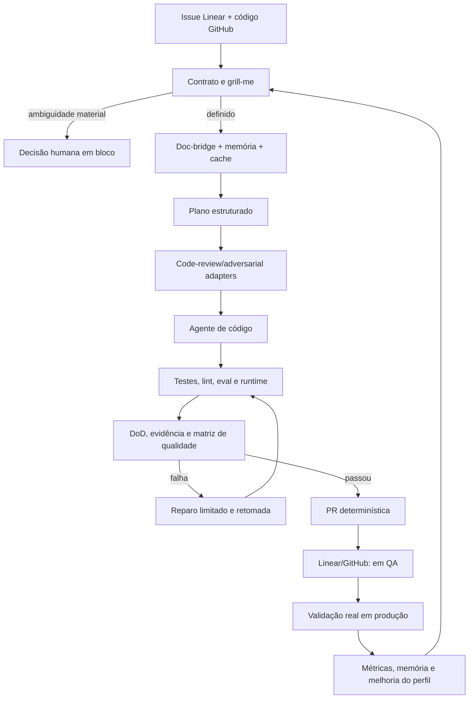
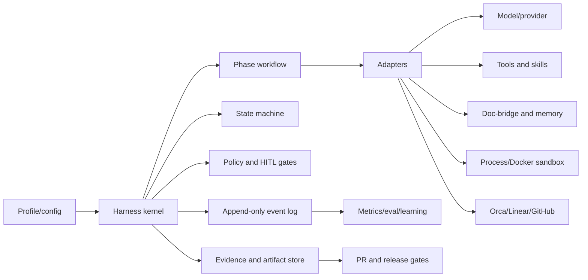

# Harness architecture roadmap: loop engineer para SDLC

Status: proposta para discussão

Este documento registra as ideias extraídas do `agentskit-devflow`, o estado
atual do `@agentskit/harness` e a direção para uma ferramenta de loop engineer:
um SDLC controlado, confiável, configurável e mensurável, sem acoplar o núcleo
a um provedor, orquestrador ou tracker específico.

## Objetivos

1. Qualidade e estrutura altas: contratos explícitos, organização previsível,
   fronteiras claras, testes determinísticos e documentação atualizada.
2. Harness modular e recomponível: capacidades podem ser trocadas por
   configuração e adapters, sem editar o kernel.
3. SDLC controlado: state machines, workflows, paralelismo limitado,
   caching, memória de agentes, gates, recuperação e auditoria.
4. Loop engineer: cada execução mede resultado, custo, tempo, falhas e
   evidências; o próximo ciclo usa esses dados para melhorar o processo.

## Missão do núcleo

O Harness é o **motor de controle do SDLC**, não o sistema responsável por
implementar todas as capacidades. Ele deve coordenar, validar, medir e impor
contratos; as capacidades concretas entram como plugins/adapters.

```text
Harness kernel
  ├─ controla: fases, state machines, gates, políticas, orçamento, evidência
  ├─ otimiza: contexto, memória, cache, paralelismo e retomada
  ├─ observa: tokens, custo, duração, CPU, memória, precisão e regressões
  └─ conecta: agentes de código, Orca, doc-bridge, code-review, trackers e runtime
```

O núcleo não deve conter um agente de código, um modelo, uma UI, um cliente
específico de GitHub/Linear ou um sandbox obrigatório. Sua função é oferecer o
protocolo para que esses componentes possam ser trocados sem reescrever o
workflow.

### Responsabilidades do núcleo

- iniciar pelo contrato da issue e executar o ciclo de descoberta/`grill-me`;
- levantar ambiguidades, opções e sugestões antes de desenvolver;
- parar apenas nos pontos de decisão humana definidos pelo contrato;
- validar documentação, código, contexto, DoD e critérios antes da PR;
- orquestrar agentes e subagentes com limites de concorrência e orçamento;
- persistir diário, decisões, artefatos, hashes e evidências;
- impedir PR incompleta, conteúdo alterado após aprovação ou transição inválida;
- retomar de forma idempotente após falha, timeout ou interrupção;
- medir qualidade, custo, velocidade, memória, cache, paralelismo e recursos da
  máquina para alimentar o próximo ciclo.

### Fora da responsabilidade do núcleo

- decidir sozinho ambiguidade de produto ou regra de negócio;
- substituir o agente de código, o modelo ou a ferramenta de revisão;
- manter cópia própria de issues e PRs;
- impor Docker quando process runtime for suficiente;
- esconder falhas transformando ausência de telemetria em zero;
- fechar issue ou marcar produção sem evidência do fluxo real.

## Contrato de plugins e adapters

Cada plugin deve declarar capacidades, entradas, saídas, efeitos e telemetria.
O kernel fornece identidade da execução, contexto vinculado, políticas,
cancelamento, orçamento e emissão de eventos.

| Plugin/adapter | Fornece | Deve devolver ao kernel |
|---|---|---|
| Agente de código | análise, edição e testes | resultado estruturado, diff, usage e falhas |
| Orca | dispatch, worktrees e terminais | lease, estado, eventos e recuperação |
| Doc-bridge | documentação e conhecimento | fontes, hashes, relevância e contexto usado |
| Code-review | revisão adversarial | verdict, findings, severidade, confiança e evidência |
| Memória | fatos e decisões reutilizáveis | hits, origem, validade e custo de contexto |
| Cache | resultados/contextos reaproveitáveis | hit/miss, chave, validade e economia estimada |
| Runtime | process ou Docker sandbox | comando, limites, attestation, saída e recursos |
| GitHub/Linear | PRs, issues e transições | estado remoto, SHA, idempotency key e confirmação |

Um plugin não pode contornar state machine, policy gate, orçamento ou vínculo de
evidência. Integrações sem telemetria continuam utilizáveis, mas são marcadas
como `unknown` e não podem ser usadas para declarar melhoria.

## Fluxo de referência do núcleo



O modo `yolo` altera somente o limiar de pausas operacionais. Não remove
ambiguidades de produto, gates de segurança, evidência ou decisões humanas.

O princípio de modularidade é inspirado no DeepSeek Harness: capacidades como
modelos, ferramentas, sessões, sandboxes, storage, loops e UI são plugins
substituíveis, e cada execução é reconstruível a partir de um log append-only.
Ver: <https://deepseek.com/harness/en/>.

## Princípios não negociáveis

- O kernel é provider-neutral; integrações vivem em `src/adapters/`.
- Configuração seleciona capacidades; não cria uma segunda implementação do
  mesmo mecanismo.
- Toda decisão relevante produz evidência vinculada a `runId`, revisão de
  código, configuração e contrato.
- O agente pode sugerir e validar; ambiguidades de produto, decisões de negócio
  e exceções materiais continuam sendo decisões humanas.
- Falhas são classificadas, têm orçamento e retomada determinística; não há
  retry infinito.
- O modo YOLO reduz pausas operacionais, mas nunca remove gates de segurança,
  evidência ou os pontos de HITL definidos pelo contrato.
- Docker é uma opção de sandbox, não uma dependência obrigatória.

## Estado atual do Harness

### Já existe

| Capacidade | Evidência no código | Avaliação |
|---|---|---|
| Workflow DAG, dependências e concorrência | `src/workflow.ts` | Base sólida; falta um perfil de fases SDLC configurável |
| State machine e contrato de verificação | `src/state-machine.ts`, `src/verification.ts`, `src/types.ts` | Cobre estados e stale evidence |
| Log, locks e recuperação | `src/events.ts`, `src/agent.ts`, `src/resilience.ts` | Base para diário, replay e retomada |
| Policy gates e aprovação | `src/policy.ts`, `src/delivery.ts` | Base para gates pré-PR e HITL |
| Runtime process/Docker | `src/runtime.ts` | Já suporta execução sem Docker e sandbox opcional |
| Doc-bridge, Orca e tracking adapters | `src/adapters/` | Fronteiras corretas; evitar clientes específicos no kernel |
| Métricas, eval, memória, cache e otimização | `src/metrics.ts`, `src/eval.ts`, `src/memory.ts`, `src/cache.ts`, `src/optimization.ts` | Instrumentação inicial; falta amarrar tudo por fase |
| Perfis e contexto | `src/profiles.ts`, `src/context.ts` | Base para modos e composição por configuração |

### Lacunas prioritárias

| Lacuna | Por que importa | Prioridade | Critério de sucesso |
|---|---|---:|---|
| Executor de fases SDLC configurável | Torna o fluxo previsível sem fixar uma topologia única | P0 | Fases, dependências, retries, gates e bloqueios reproduzíveis |
| Artefatos versionados de fase | Evita plano, revisão e PR sem proveniência | P0 | JSON/Markdown legível, schema versionado, hashes e stale detection |
| Diário/retomada por fase | Retoma sem repetir trabalho nem perder contexto | P0 | Resume idempotente a partir do event log |
| Revisão adversarial estruturada | Encontra ambiguidades e riscos antes de codificar | P0 | Verdict com evidência; reviewer ausente bloqueia ou escala |
| Gate de conteúdo imutável da PR | Garante que o publicado é exatamente o aprovado | P0 | Mudança no corpo invalida o gate |
| Lock/worktree por issue | Evita colisões entre execuções | P1 | Claim idempotente, branch determinística e limpeza segura |
| Dry-run de efeitos externos | Testa o fluxo completo sem GitHub/Linear/git | P1 | Zero efeitos externos e mesma topologia |
| Orçamento por fase | Permite otimizar tokens, custo, tempo e CPU/memória | P1 | Cap por run/fase e dados ausentes tratados como desconhecidos |
| Corpus de eval de issues reais | Mede melhoria contínua em vez de opinião | P1 | Runs comparáveis por versão, issue e perfil |

## Arquitetura-alvo



### Fronteiras

- **Kernel:** workflows, state machines, policies, events, hashes, evidence,
  budgets e métricas comuns.
- **Plugins/adapters:** modelo, agente, ferramentas, skills, memória, cache,
  sandbox, orquestrador, tracker e publicação.
- **Perfil:** composição declarativa de capacidades, fases, gates, limites e
  modo operacional (`safe`, `yolo`, `dry-run`).
- **Projeto:** contrato, critérios de aceite, contexto e regras locais.

O kernel nunca importa um adapter. Um adapter pode depender do kernel, declarar
capabilities e emitir eventos/telemetria no protocolo comum.

## Itens aproveitados do `agentskit-devflow`

### Adicionar ao Harness

1. **Phase profile:** uma topologia declarativa, inspirada nas fases do
   devflow, mas não fixa em dez etapas.
2. **Artifact envelope:** `schemaVersion`, `phase`, `runId`, `issueRef`,
   `status`, `createdAt`, `data` e `body`, com persistência segura e hashes.
3. **Verdict estruturado:** findings, severidade, evidência, confiança e ação
   (`pass`, `repair`, `block`, `escalate`).
4. **Painel adversarial paralelo:** múltiplas lentes configuráveis, retries
   limitados e fail-closed quando falta evidência.
5. **Publicação imutável:** hash do conteúdo pré-PR ligado aos gates de entrega.
6. **Dry-run real:** substitui efeitos externos, mantendo roteamento, schemas,
   budgets e idempotência.
7. **Budget multidimensional:** tokens input/output/cache, custo, duração e
   recursos da máquina, por fase e por execução.
8. **Eval manifest:** casos reais, perfil usado, versão do Harness, métricas e
   comparação com baseline.

### Manter fora do núcleo

- Topologia fixa do devflow.
- Providers Claude/OpenCode/modelos específicos.
- Clientes concretos de GitHub e Linear.
- Personas e schemas duplicados quando o Harness já possui contratos.
- Estrutura `.devflow` inteira; usar `stateDir`, eventos e evidências atuais.
- Novo executor de shell; reutilizar `runtime.ts` e adicionar apenas políticas
  que estejam realmente faltando.

## Matriz de qualidade do loop engineer

Cada run deve registrar nota de 0 a 100 por dimensão, além dos valores brutos.
Uma nota agregada nunca substitui os critérios individuais.

| Dimensão | Medidas mínimas | Sinal de regressão |
|---|---|---|
| Definição | ambiguidades detectadas, critérios completos, decisões pendentes | implementação iniciada com blocker aberto |
| Execução | fases concluídas, retries, retomadas, tempo por fase | retry/rework crescente |
| Qualidade técnica | testes, lint, tipos, findings adversariais, defeitos pós-merge | PR ainda exige correções estruturais |
| Evidência | critérios com evidência atual, hashes, proveniência | evidência ausente/stale |
| Eficiência | tokens, cache hit, custo, duração, CPU e memória | custo/tempo sobe sem ganho de qualidade |
| Paralelismo | throughput, peak concurrency, contenção e falhas | saturação ou serialização inesperada |
| Memória/contexto | reutilização, relevância, tamanho e custo de contexto | contexto repetido ou irrelevante |
| Entrega | PRs completas, DoD, transições Linear/GitHub, rollback | PR aberta incompleta ou issue fora de estado |
| Segurança | policy violations, sandbox, secrets e efeitos externos | ação fora do contrato |
| Aprendizado | blockers recorrentes resolvidos, baseline e delta por versão | mesma falha reaparece sem ajuste |

## Roadmap mínimo

1. Implementar phase profile + artifact envelope.
2. Integrar diário/retomada e lock por issue.
3. Adicionar painel adversarial e gate imutável de PR.
4. Fechar dry-run e comprovar ausência de efeitos externos.
5. Instrumentar budget por fase e recursos da máquina.
6. Rodar corpus de issues reais e comparar Harness com baseline.
7. Só depois considerar um sistema formal de plugins; antes disso, adapters e
   profiles já entregam a maior parte do valor com menos complexidade.

## Decisões ainda abertas

- Formato final do profile: JSON, YAML ou objeto TypeScript validado.
- Persistência de artefatos: somente filesystem local ou storage adapter.
- Quais fases são obrigatórias no perfil piloto.
- Pesos da nota agregada e thresholds que geram HITL.
- Retenção e anonimização dos logs de memória/contexto.
- Primeiro corpus de issues e baseline sem Harness.

Estas decisões devem ser fechadas em bloco pelo humano quando mudarem produto,
risco, custo ou política; o agente deve apenas levantar opções, evidências e
recomendação.

## Plano consolidado de execução

O plano começa pela organização interna. Nenhuma capacidade nova deve ser
adicionada antes de confirmar que pertence ao kernel ou a um adapter.

### Fase 0 — Baseline e contrato arquitetural

- congelar a revisão atual e registrar baseline de testes, métricas e tamanho;
- manter a organização capability-first e Conventional Commits do Angular;
- documentar dependências permitidas: kernel não importa adapters;
- criar uma matriz de export público versus módulo interno;
- definir o contrato de plugin: capabilities, lifecycle, efeitos, cancelamento,
  telemetria, erros e versionamento.

**Saída:** mapa de módulos, regras de dependência e contrato de extensão.

### Fase 1 — Separação kernel/adapters

Manter no kernel apenas mecanismos genéricos:

```text
src/
  kernel/       # workflow, machine, policy, events, evidence, hashes
  execution/    # runtime, recovery, coordination, budgets, metrics
  context/      # contratos de contexto, memória e cache
  delivery/     # gates e composição determinística
  adapters/     # Orca, doc-bridge, GitHub, Linear, code-review, providers
  profiles/     # composição declarativa de capacidades e modos
```

A migração deve ser mecânica e compatível: mover por capability, preservar
exports públicos, executar typecheck/testes a cada grupo e só então remover
atalhos antigos. Não criar diretórios para arquivos únicos sem ganho de
fronteira.

**Saída:** dependências direcionais e API pública estável.

### Fase 2 — Motor determinístico de SDLC

- adicionar `phase profile` configurável sobre o workflow existente;
- representar cada fase por entrada, saída, gate, retry e artefato;
- executar preflight/`grill-me` antes de qualquer mutação;
- agrupar ambiguidades para uma única decisão humana;
- permitir execução automática quando o contrato estiver completo;
- suportar `safe`, `yolo` e `dry-run` sem duplicar o motor.

**Saída:** o mesmo contrato produz o mesmo roteamento, sem topologia fixa.

### Fase 3 — Artefatos, diário e proveniência

- implementar `ArtifactEnvelope` versionado em JSON e representação legível;
- ligar artefato a `runId`, issue, SHA, configuração e hash do contexto;
- usar o event log como diário único para retomada, replay e auditoria;
- registrar decision log, findings, reparos e blockers;
- invalidar evidência quando fonte, contrato ou configuração mudarem.

**Saída:** nenhuma PR pode ser montada a partir de estado implícito.

### Fase 4 — Adapters operacionais

- agente de código: provider-neutral, com diff, testes, usage e falhas;
- Orca: dispatch, lease, worktree determinístico, lock por issue e cleanup;
- doc-bridge: contexto com fonte, hash, relevância e custo;
- code-review: painel adversarial paralelo e verdict estruturado;
- GitHub/Linear: PR, issue e transições idempotentes;
- runtime: process ou Docker conforme profile, sempre com attestation.

**Saída:** componentes podem ser trocados sem modificar o kernel.

### Fase 5 — Gates de entrega

- revisão e auditoria antes do agente abrir PR;
- conteúdo da PR derivado de campos estruturados e protegido por hash;
- publicação somente após todos os gates e checks passarem;
- transição explícita para `QA` após validação de feature;
- produção só após evidência de validação real;
- confirmação de branch/SHA remoto antes de limpar worktree.

**Saída:** a PR vira lapidação, não local de descoberta ou correção estrutural.

### Fase 6 — Eficiência e observabilidade

- medir tokens de entrada/saída/cache, custo e duração por fase;
- medir cache hit/miss, memória recuperada e relevância do contexto;
- medir paralelismo, contenção, CPU, memória e saturação da máquina;
- classificar falhas e aplicar watchdog com orçamento limitado;
- fixar provider/modelo nos experimentos comparativos;
- nunca converter telemetria ausente em zero.

**Saída:** cada ciclo mostra se ficou mais rápido, barato e preciso.

### Fase 7 — Loop engineer

- manter corpus de issues reais e baseline sem Harness;
- rodar eval por versão, profile e provider fixados;
- atribuir notas por dimensão da matriz de qualidade;
- gerar pacote periódico de resultados e blockers;
- transformar aprendizados aprovados em mudanças de profile ou adapter;
- repetir: executar → medir → revisar → ajustar → validar.

**Saída:** melhoria contínua baseada em evidência, não em percepção.

## Critérios de passagem entre fases

Uma fase só avança quando:

- seus contratos estão versionados;
- testes de fronteira e integração relevantes passam;
- há evidência vinculada ao run e à revisão atual;
- nenhum blocker obrigatório permanece aberto;
- custo e impacto operacional foram medidos;
- a matriz de qualidade mostra nota e tendência, não apenas `pass/fail`.

O plano não autoriza implementar todas as fases de uma vez. A menor fatia
útil é Fase 0 + Fase 1; depois Fase 2 + Fase 3. Cada incremento deve ser
validado antes de iniciar o próximo.

## Práticas incorporadas do Agents Playbook

O Playbook é modular: cada prática deve entrar porque previne uma falha
observada, não por completude estética. O mapa oficial organiza as práticas por
seis pilares e seis fases do SDLC; abaixo estão as que têm relação direta com o
Harness. Referência: <https://playbook.agentskit.io/llms.txt>.

### Dia zero — invariantes do kernel

Estas regras devem ser verificáveis antes de adicionar novas capacidades:

| Prática | Aplicação no Harness |
|---|---|
| Typed boundaries | Validar toda entrada de profile, plugin, evento, artefato e adapter |
| Named exports | API pública previsível; evitar exports implícitos |
| Error hierarchy | Códigos estáveis e classificáveis para retry, block e escalation |
| ADR/RFC antes da mudança | ADR para arquitetura; RFC para mudança de contrato público/plugin |
| Verify-first | Confirmar issue, branch, SHA, contexto e estado remoto antes de agir |
| Honest confidence | Separar `automated-verified`, `claimed`, `not-verified` e `known-not-done` |
| Fail-loud defaults | Adapter obrigatório não pode cair silenciosamente em no-op |
| PR intent | Manifesto estruturado de `adds`, `changes`, `removes`, `tests` e `docs` |
| Quality gates | Um comando rápido para gates estruturais antes de push e no CI |
| Egress deny-by-default | Runtime e adapters só acessam destinos explicitamente permitidos |
| Dependency hygiene | Mudança de dependência exige motivo, impacto e verificação |

### Dia zero — comportamento dos agentes

- **Bootstrap/routing docs:** um documento de entrada curto e uma tabela que
  aponta cada tipo de mudança para o pacote correto.
- **Prompt registry:** prompts e descrições de ferramentas nomeados,
  versionados, com hash e eval associado; não strings anônimas no código.
- **Context management:** seleção, ordenação, compactação e retenção explícitas;
  doc-bridge e memória retornam origem, relevância e custo.
- **Hallucination guard:** geração estruturada, grounding e abstention quando a
  evidência não sustenta a resposta.
- **Sub-agent contract:** escopo, critérios, capacidades e evidência exigidos
  por delegação; resultado de subagente nunca aprova o trabalho pai.
- **Three-tier eval:** determinístico em todo commit, LLM-as-judge em mudanças
  de prompt/modelo e sinais de produção após o merge.

## Event Bridge

É uma boa extensão, mas não deve virar dependência do kernel no dia zero.

### Contrato a definir desde o dia zero

O evento deve carregar, no mínimo:

```text
eventId, eventType, schemaVersion, occurredAt,
runId, issueRef, sourceRevision, correlationId,
payload, idempotencyKey, provenance
```

Regras obrigatórias:

- entrega assumida como at-least-once;
- consumidores idempotentes;
- schema evolui de forma compatível;
- replay e inspeção disponíveis;
- falha de consumidor vai para estado classificável/DLQ;
- backpressure não pode travar o workflow principal.

### Implementação recomendada

1. **Agora:** usar o event log append-only local como fonte de verdade e
   publicar um `EventSink`/`EventBridge` interface sem broker externo.
2. **Depois:** adapter para fila, pub/sub ou stream somente quando houver
   consumidores independentes reais (dashboard, analytics, watchdog remoto ou
   múltiplos workers).

Não escolher Kafka, NATS, Redis ou outro broker antes de medir volume,
durabilidade e latência necessários.

## MCP

MCP é interessante como fronteira de integração para agentes e ferramentas,
não como camada interna de orquestração. O Harness deve continuar funcionando
sem MCP.

### O que expor

- descobrir profiles e capabilities;
- iniciar, consultar, pausar, retomar e cancelar runs;
- ler artefatos, evidências, decision log e matriz de qualidade;
- consultar status de gates e blockers;
- pedir contexto do doc-bridge/memória com orçamento explícito.

### O que não expor sem gate

- execução arbitrária de shell;
- publicação de PR;
- alteração de issue/transição remota;
- limpeza de worktree;
- acesso a secrets ou contexto fora do escopo.

### Implementação recomendada

1. Definir manifest de capabilities e contratos tipados no kernel.
2. Criar adapter MCP read-only, preferencialmente local/stdio, para validar a
   superfície e a proveniência.
3. Adicionar operações mutáveis somente após policy gate, autorização,
   idempotência e auditoria estarem comprovadas.

## Outros pontos que valem existir desde o início

- `runId`, `correlationId`, `issueRef` e `sourceRevision` em todas as interfaces;
- versionamento de schemas e estratégia explícita de compatibilidade;
- cancelamento cooperativo e timeout em cada plugin;
- classificação de efeitos (`read`, `write`, `external`, `privileged`);
- feature flags para capacidades experimentais e rollback simples;
- limites de tamanho de arquivo e de contexto para manter revisão humana viável;
- threat model mínimo, classificação de dados e redaction de logs;
- status/posture read-only para expor o que está realmente sendo aplicado;
- tombstone para retirar docs, profiles ou adapters sem perder histórico;
- pacote de verificação que separa evidência automatizada de alegações.

## Priorização revisada

| Horizonte | Entram | Não entram ainda |
|---|---|---|
| Dia zero | contratos tipados, erros estáveis, verify-first, confidence honesta, PR intent, gates, prompts versionados, IDs/proveniência, event schema, capability manifest | broker externo, MCP mutável, plugin loader dinâmico complexo |
| Primeiro piloto | kernel/adapters, phase profiles, artefatos, diário, memória/cache mensuráveis, code-review adversarial, dry-run | cluster distribuído, dashboard próprio, múltiplos brokers |
| Após evidência | Event Bridge externo, MCP mutável, watchdog remoto, analytics e adapters adicionais | abstrações sem consumidor real |

Essa priorização mantém o núcleo pequeno, mas evita decisões irreversíveis:
interfaces, schemas, eventos, proveniência, cancelamento e telemetria são
definidos cedo; infraestrutura só entra quando o piloto demonstrar necessidade.

## Plano fechado para a versão 0.4.0

### Objetivo da release

Entregar a primeira versão do Harness como **motor SDLC modular**: um kernel
organizado, profiles de workflow determinístico, artefatos/proveniência,
contratos de adapters e observabilidade suficiente para executar o piloto com
agentes reais sem transformar a PR em uma etapa de descoberta.

### Baseline

- Versão de partida: `0.3.0`.
- API pública atual deve permanecer compatível; reorganização interna não pode
  quebrar imports de `src/index.ts`.
- Node.js `>=22`, pnpm e workflow de publicação por merge na `main` com npm
  Trusted Publishing; nenhum `NPM_TOKEN`.
- O pacote continua provider-neutral e funciona com process runtime sem Docker.

### Dentro do escopo da 0.4.0

- separação verificável entre kernel, execução, contexto, delivery, profiles e
  adapters;
- contrato de capability/plugin versionado;
- phase profiles configuráveis com dependências, gates e retries limitados;
- `ArtifactEnvelope` JSON + representação legível;
- diário baseado no event log e retomada idempotente por fase;
- preflight/`grill-me` estruturado com bloco de ambiguidades e sugestões;
- verdict adversarial com evidência e fail-closed;
- PR intent e montagem determinística da PR com hash do conteúdo aprovado;
- métricas por fase para tokens, custo, cache, memória, duração, paralelismo,
  CPU, memória da máquina e falhas;
- contratos para agente de código, Orca, doc-bridge, code-review, memória,
  cache, runtime e GitHub/Linear;
- profiles `safe`, `yolo` e `dry-run` usando o mesmo motor;
- quality gates, eval determinístico e documentação de uso/extensão;
- contrato de Event Bridge e capability manifest para futura integração MCP.

### Fora do escopo da 0.4.0

- broker externo (Kafka, NATS, Redis, etc.);
- MCP com operações mutáveis ou servidor remoto;
- marketplace/loader dinâmico de plugins;
- dashboard próprio ou nova UI;
- clientes específicos obrigatórios de GitHub, Linear ou modelos;
- migração automática de todos os consumidores sem compatibilidade;
- otimizações sem baseline mensurável.

## Issues/entregáveis da 0.4.0

Cada issue deve ser uma unidade vertical, com contrato, evidência e rollback
claros. A numeração é proposta para o backlog local.

### H-040 — Baseline e mapa de fronteiras

- [ ] inventariar todos os módulos, imports e exports públicos;
- [ ] classificar cada módulo como kernel, execução, contexto, delivery,
      profile ou adapter;
- [ ] registrar dependências proibidas e exceções justificadas;
- [ ] registrar baseline de typecheck, testes, build, pack e métricas;
- [ ] criar ADR da separação kernel/adapters.

DoD: mapa revisado, baseline reproduzível e nenhum código comportamental novo.

### H-041 — Contratos de capability, evento e erro

- [ ] definir interfaces versionadas de plugin/capability;
- [ ] padronizar lifecycle, cancelamento, timeout, efeitos e telemetria;
- [ ] padronizar envelope de evento e idempotency key;
- [ ] garantir códigos de erro estáveis e classificáveis;
- [ ] adicionar validação de schema nas fronteiras;
- [ ] publicar capability manifest estático.

DoD: contratos compilam, têm testes de round-trip/compatibilidade e nenhum
adapter é necessário para executar o kernel.

### H-042 — Organização física e API compatível

- [ ] mover módulos por capability apenas quando houver fronteira real;
- [ ] preservar reexports de `src/index.ts`;
- [ ] eliminar imports do kernel para adapters;
- [ ] manter named exports e convenção de nomes;
- [ ] adicionar teste de dependência direcional;
- [ ] atualizar `docs/ORGANIZATION.md` e ADRs afetados.

DoD: typecheck, testes de consumer e pacote continuam passando sem mudança
externa de API.

### H-043 — Phase profile e executor determinístico

- [ ] definir schema de profile com fases, entradas, saídas, dependências,
      gates, retry e orçamento;
- [ ] compor sobre `runWorkflow`, state machine e policy atuais;
- [ ] suportar preflight antes de qualquer mutação;
- [ ] agrupar ambiguidades para uma decisão humana única;
- [ ] implementar `safe`, `yolo` e `dry-run` por configuração;
- [ ] bloquear ciclos não permitidos e retries infinitos.

DoD: o mesmo contrato gera o mesmo plano e os testes cobrem pass, block,
escalate, retry, cancel e resume.

### H-044 — Artefatos, decision log e retomada

- [ ] implementar `ArtifactEnvelope` versionado;
- [ ] vincular artefatos a run, issue, SHA, contrato, config e contexto;
- [ ] registrar plano, findings, decisões, reparos e blockers;
- [ ] retomar a partir do event log sem repetir efeitos concluídos;
- [ ] invalidar artefatos/evidências stale;
- [ ] fornecer inspeção CLI legível e JSON.

DoD: interrupção em cada fase pode ser retomada de forma idempotente e o
conteúdo reconstruído tem a mesma hash da execução original.

### H-045 — Adapters de execução e contexto

- [ ] adaptar agente de código com saída estruturada, diff, usage e falhas;
- [ ] completar Orca com lease, worktree determinístico, lock por issue e
      confirmação de SHA remoto antes de cleanup;
- [ ] enriquecer doc-bridge com relevância, fonte, hash e custo;
- [ ] integrar memória e cache com hit/miss, validade e economia;
- [ ] manter process/Docker selecionável por profile;
- [ ] manter GitHub/Linear como efeitos externos idempotentes.

DoD: cada adapter pode ser substituído por fake no dry-run e não contorna
policy, orçamento ou evidência.

### H-046 — Revisão adversarial e delivery gates

- [ ] adicionar painel de reviewers/lentes configurável e paralelo;
- [ ] exigir evidência/reprodução para findings;
- [ ] tratar reviewer ausente como unverified/block;
- [ ] gerar PR intent a partir de campos estruturados;
- [ ] proteger corpo da PR com hash e binding de G2/G3;
- [ ] publicar apenas após checks, DoD e auditoria passarem;
- [ ] transicionar Linear para `QA` após validação de feature.

DoD: uma PR incompleta, alterada após aprovação ou sem evidência não pode ser
publicada pelo fluxo.

### H-047 — Telemetria, eval e matriz de qualidade

- [ ] registrar métricas por fase e por adapter;
- [ ] medir tokens input/output/cache, custo, duração, CPU e RAM;
- [ ] medir memória/contexto recuperado, cache hit/miss e paralelismo;
- [ ] classificar falhas e aplicar watchdog com orçamento;
- [ ] executar a bateria de eval antes do uso do Harness e em todo commit relevante;
- [ ] produzir nota 0–100 por dimensão e delta contra baseline;
- [ ] nunca tratar telemetria ausente como zero.

DoD: relatório reproduzível mostra qualidade, custo, velocidade, precisão e
recursos; regressões têm blocker ou justificativa registrada.

### H-047A — Eval battery e impacto no ecossistema AgentsKit

Testes normais verificam implementação. Evals verificam se o sistema continua
produzindo o comportamento desejado, com qualidade mínima e sem regressão. Os
dois são obrigatórios e não são intercambiáveis.

#### Camadas da bateria

1. **Contract eval:** schemas, exports, erros, eventos, idempotência e
   compatibilidade de versões.
2. **Deterministic behavior eval:** state machine, workflow, gates, retries,
   cancelamento, resume, dry-run e ausência de efeitos indevidos.
3. **Integration eval:** executa cada adapter real que foi tocado, com fakes
   controlados e, quando autorizado, uma amostra real do provider.
4. **Quality eval:** rubric de completude, precisão, grounding, evidência,
   decisão de bloquear/escalar e qualidade da PR.
5. **Regression eval:** corpus/golden de issues reais, comparado à versão
   anterior e ao baseline sem Harness.
6. **Resource eval:** tokens, cache, memória, duração, paralelismo, CPU/RAM e
   custo sob orçamento.

#### Regra de escopo

O manifesto de eval deve declarar os componentes tocados e expandir a bateria
correspondente:

| Componente tocado | Evals obrigatórios |
|---|---|
| Kernel/core | contratos, determinismo, replay/resume, policy e compatibilidade |
| Workflow/state machine | transições legais/ilegais, ciclos, retry, cancelamento e fan-out/fan-in |
| Memória | escopo, relevância, contaminação, TTL, redaction, custo e limite de contexto |
| Cache | chave, validade, hit/miss, invalidação, isolamento e economia real |
| Doc-bridge/contexto | recall/precision, fonte/citação, hash, stale rejection e custo |
| Adapter de agente/modelo | schema de saída, tool calls, usage, timeout, abort e falhas |
| Orca/worktree | claim/lock, branch determinística, lease, conflito, resume e cleanup seguro |
| Runtime process/Docker | limites, paridade, egress, attestation, timeout, cancelamento e saída |
| Code-review | lentes independentes, refutação, reprodução e reviewer ausente |
| GitHub/Linear | idempotência, estados, SHA remoto, PR intent e transições |
| Eval/metrics | calibração, reprodutibilidade, falsos positivos/negativos e schema do relatório |

Se um componente do AgentsKit for modificado, não basta rodar os testes do
Harness: o conjunto de evals desse componente entra no gate da issue e do
release. Componentes não tocados recebem smoke eval e verificação de
compatibilidade.

#### Critérios mínimos recomendados

- contratos críticos: 100% pass;
- segurança, policy, proveniência e idempotência: 100% pass;
- comportamento determinístico: 100% pass no corpus obrigatório;
- qualidade subjetiva: nota mínima definida no manifesto, recomendação inicial
  de 80/100;
- nenhuma dimensão pode regredir mais de 5 pontos sem decisão registrada;
- nenhum resultado `unknown`, `unverified` ou `stale` pode ser contado como
  aprovação;
- qualquer falha em componente tocado bloqueia a execução dependente;
- qualquer mudança de prompt, modelo, memória, cache ou adapter exige eval
  comparativo e atualização do baseline.

#### Artefatos exigidos

- manifesto versionado de casos, componentes e thresholds;
- inputs/outputs ou referências hash-bound, sem secrets;
- relatório por caso, componente e dimensão;
- comparação com baseline anterior;
- versão do Harness, profile, provider/modelo e prompt registry;
- decisão explícita para regressões aceitas ou casos não comparáveis.

O Harness deve oferecer o runner e o protocolo; os casos específicos de cada
produto ou provider permanecem em manifests/adapters externos.

### H-048 — Documentação, examples e adoção

- [ ] atualizar README com arquitetura kernel/adapters;
- [ ] documentar profile mínimo, adapter mínimo e modo dry-run;
- [ ] incluir exemplo de agente, doc-bridge, code-review e tracking;
- [ ] publicar guia de extensão e troubleshooting;
- [ ] registrar ADRs, changelog e migration notes;
- [ ] adicionar capability manifest e comandos de inspeção.

DoD: um consumidor consegue instalar, executar um profile fake e criar um
adapter sem ler o código interno.

### H-049 — Hardening e release candidate

- [ ] executar testes unitários, contrato, integração e CLI real;
- [ ] executar testes de consumer a partir do tarball;
- [ ] rodar `ak-verify` no contrato atual;
- [ ] validar build, pack, exports, README e ausência de arquivos indevidos;
- [ ] rodar benchmark/eval do piloto com provider fixado;
- [ ] realizar revisão adversarial do diff completo;
- [ ] fechar ou classificar todos os blockers.

DoD: nenhum critério P0 pendente e release candidate reproduzível a partir de
uma revisão limpa.

## Matriz de qualidade e gates da release

Além de todos os checks obrigatórios passarem, a release deve apresentar:

| Dimensão | Gate 0.4.0 |
|---|---|
| Contratos e proveniência | 100% das interfaces externas schema-validadas e hash-bound |
| Determinismo | 100% dos casos do profile de referência reproduzíveis |
| Eval battery | 100% das camadas obrigatórias e dos componentes tocados executadas |
| Segurança | zero violações de policy/egress/secrets nos cenários de release |
| Evidência | 100% dos critérios do piloto com evidência atual |
| Delivery | zero PRs publicadas sem intent, DoD e auditoria |
| Recuperação | todos os pontos de interrupção do profile retomáveis ou bloqueados honestamente |
| Eficiência | baseline registrado; nenhuma regressão >10% sem justificativa |
| Qualidade técnica | typecheck, testes, build, pack e consumer green |
| Documentação | README, organização, ADR, changelog e exemplos atualizados |
| Observabilidade | tokens/custo/duração/recursos desconhecidos explicitamente, nunca zero falso |

Uma média alta não compensa um gate P0 falho. A versão não sai enquanto houver
critério obrigatório `blocked`, `unverified` ou `stale`.

## Sequência e dependências

```text
H-040 → H-041 → H-042 → H-043 → H-044
                              ↘ H-045 → H-046 → H-047 → H-048 → H-049
```

H-045 pode iniciar em paralelo com H-043 após H-041, desde que use contratos
estáveis. H-046 depende de H-043 e H-044. H-047 e H-047A começam cedo para
coletar baseline, mas só fecham após H-045/H-046 e a avaliação de todo
componente tocado. H-049 é exclusivamente hardening e release, não lugar para
novas features.

## Checklist de publicação da 0.4.0

1. Merge de todas as issues em `main` na ordem de dependência.
2. Atualizar `package.json` para `0.4.0` e `CHANGELOG.md` com mudanças e
   incompatibilidades (idealmente nenhuma).
3. Rodar `pnpm typecheck`, `pnpm test`, `pnpm build` e `pnpm pack`.
4. Rodar o fluxo CLI real, `ak-verify run --config .codex/verification.json
   --json`, a bateria de eval completa e os benchmarks do piloto.
5. Confirmar revisão, contrato, configuração e run IDs no relatório final.
6. Fazer merge na `main`; o workflow de release publica por Trusted Publishing
   somente se a versão mudou.
7. Verificar no registry o tarball e a versão `@agentskit/harness@0.4.0`.
8. Executar smoke test como consumidor instalado do pacote publicado.
9. Registrar evidência da publicação e iniciar o próximo baseline.

Se qualquer etapa falhar, a release fica `BLOCKED`; não há publicação manual
alternativa nem bypass de gate.
