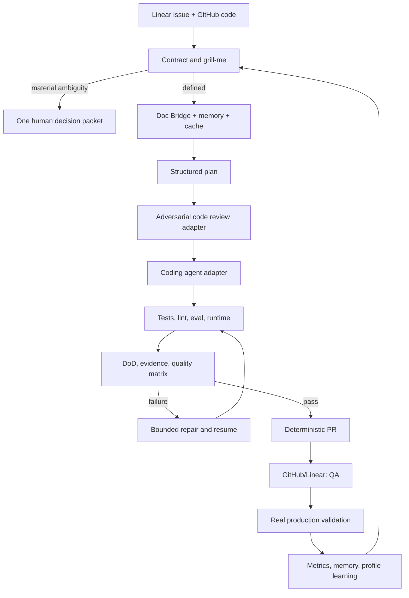

# Harness 0.4.0 PRD and architecture roadmap

Status: proposal for implementation and release

This document consolidates the ideas extracted from `agentskit-devflow`, the
AgentsKit Playbook, and the current `@agentskit/harness` implementation. It is
the working PRD for the Harness as a modular SDLC control engine and loop
engineer.

## Product objective

The Harness must make agent-assisted delivery predictable, auditable,
configurable, and measurable without becoming a monolithic replacement for
agents, orchestrators, trackers, or developer tools.

1. High-quality structure: explicit contracts, predictable organization,
   directional dependencies, deterministic tests, and current documentation.
2. Modular composition: capabilities are replaceable through profiles and
   adapters without editing the kernel.
3. Controlled SDLC: state machines, workflows, bounded parallelism, caching,
   agent memory, gates, recovery, and auditability.
4. Loop engineering: every run measures outcome, cost, speed, failures, and
   evidence so the next iteration can improve the process.

## Kernel mission and boundary

The Harness is the **SDLC control plane**. It coordinates, validates, measures,
and enforces contracts. Concrete capabilities are supplied by adapters.

```text
Harness kernel
  ├─ controls: phases, state machines, gates, policies, budgets, evidence
  ├─ optimizes: context, memory, cache, parallelism, and recovery
  ├─ observes: tokens, cost, duration, CPU, memory, precision, regressions
  └─ connects: coding agents, Orca, Doc Bridge, code review, trackers, runtime
```

The kernel must not contain a coding agent, model, UI, mandatory Docker
sandbox, or concrete GitHub/Linear client. It provides protocols so those
components can be swapped without rewriting workflows.

### Kernel responsibilities

- start from the issue contract and run the discovery/`grill-me` cycle;
- surface ambiguities, options, and recommendations before development;
- stop only at material human decisions defined by the contract;
- validate documentation, code, context, DoD, and acceptance criteria before
  opening a PR;
- orchestrate agents and sub-agents with concurrency and budget limits;
- persist decisions, artifacts, hashes, events, and evidence;
- prevent incomplete PRs, changed approved content, and invalid transitions;
- resume idempotently after failure, timeout, or interruption;
- measure quality, cost, speed, memory, cache, parallelism, and machine load.

### Out of the kernel

- deciding product ambiguity or business rules autonomously;
- replacing the coding agent, model, or review tool;
- maintaining a shadow copy of issues or PRs;
- requiring Docker when a process runtime is sufficient;
- treating missing telemetry as zero;
- closing an issue or claiming production validation without evidence.

## Plugin and adapter contract

Every plugin declares capabilities, inputs, outputs, effects, lifecycle,
cancellation, errors, and telemetry. The kernel provides run identity, bound
context, policy, budget, cancellation, and event emission.

| Adapter | Provides | Must return |
|---|---|---|
| Coding agent | Analysis, edits, and tests | Structured result, diff, usage, failures |
| Orca | Dispatch, leases, worktrees | Lease, state, events, recovery data |
| Doc Bridge | Documentation and knowledge | Sources, hashes, relevance, context used |
| Code review | Adversarial review | Verdict, findings, severity, confidence, evidence |
| Memory | Reusable facts and decisions | Hits, origin, validity, context cost |
| Cache | Reusable results/context | Hit/miss, key, validity, savings estimate |
| Runtime | Process or Docker execution | Command, limits, attestation, output, resources |
| GitHub/Linear | PRs, issues, transitions | Remote state, SHA, idempotency key, confirmation |

Adapters may not bypass the state machine, policy gate, budget, or evidence
binding. Missing telemetry is `unknown`, never an implicit success.

## Reference workflow



`yolo` changes operational pause thresholds only. It never removes product
decisions, security gates, evidence requirements, or mandatory HITL points.

## Current Harness state

| Capability | Evidence | Assessment |
|---|---|---|
| Workflow DAG and concurrency | `src/workflow.ts` | Strong base; needs configurable SDLC phase profiles |
| State machine and verification contract | `src/state-machine.ts`, `src/verification.ts`, `src/types.ts` | Covers transitions and stale evidence |
| Event log, locks, recovery | `src/events.ts`, `src/agent.ts`, `src/resilience.ts` | Base for diary, replay, and resume |
| Policy and delivery gates | `src/policy.ts`, `src/delivery.ts` | Base for pre-PR gates and HITL |
| Process/Docker runtime | `src/runtime.ts` | Docker optional; process mode supported |
| Doc Bridge, Orca, tracking adapters | `src/adapters/` | Correct direction; keep providers outside the kernel |
| Metrics, eval, memory, cache | `src/metrics.ts`, `src/eval.ts`, `src/memory.ts`, `src/cache.ts` | Initial instrumentation; bind it to phases |
| Profiles and context | `src/profiles.ts`, `src/context.ts` | Base for modes and composition |

## Agents Playbook practices to adopt

The Playbook is modular; adopt a practice because it prevents a real failure,
not to create completeness theater. Reference:
<https://playbook.agentskit.io/llms.txt>.

### Day-zero kernel invariants

- typed boundaries for profiles, plugins, events, artifacts, and adapters;
- named exports and stable public entry points;
- stable typed error hierarchy and machine-readable error codes;
- ADR before architecture changes and RFC before breaking public contracts;
- verify-first checks for issue, branch, SHA, context, and remote state;
- honest confidence: `automated-verified`, `claimed`, `not-verified`,
  `known-not-done`;
- fail-loud defaults for mandatory dependencies;
- structured PR intent (`adds`, `changes`, `removes`, `tests`, `docs`);
- fast quality gates before push and in CI;
- deny-by-default egress and dependency hygiene.

### Agent behavior

- bootstrap and routing documents that tell an agent what to read and where to
  edit;
- versioned prompt and tool registries with hashes and eval results;
- explicit context selection, ordering, compaction, retention, and cost;
- grounding, constrained generation, and abstention when evidence is weak;
- scoped sub-agent contracts; child results never approve the parent task;
- three-tier eval: deterministic, LLM-as-judge, and production monitoring.

## Event Bridge

Event Bridge is useful, but an external broker is not a day-zero dependency.

Define the contract now:

```text
eventId, eventType, schemaVersion, occurredAt,
runId, issueRef, sourceRevision, correlationId,
payload, idempotencyKey, provenance
```

Rules: at-least-once delivery, idempotent consumers, compatible schema
evolution, replay, inspection, dead-letter handling, and backpressure that
cannot stall the main workflow.

Implementation order:

1. Use the existing append-only event log as the source of truth and define an
   `EventSink`/`EventBridge` interface.
2. Add a queue, pub/sub, or stream adapter only when real independent
   consumers require it.

Do not select Kafka, NATS, Redis, or another broker before measuring volume,
durability, and latency needs.

## MCP

MCP is an integration boundary, not the internal orchestration layer. The
Harness must remain fully usable without MCP.

Initial read-only surface:

- discover profiles and capabilities;
- start, inspect, pause, resume, and cancel runs;
- read artifacts, evidence, decisions, and blockers;
- inspect gate status and quality metrics;
- request bounded Doc Bridge or memory context.

Do not expose without a policy gate: arbitrary shell execution, PR publication,
remote issue transitions, worktree cleanup, secrets, or out-of-scope context.

Implement the capability manifest first, then a local/stdio read-only MCP
adapter. Add mutating operations only after authorization, idempotency, and
audit evidence are proven.

## Consolidated execution plan

### Phase 0 — Baseline and architectural contract

- inventory modules, imports, and public exports;
- classify modules as kernel, execution, context, delivery, profile, or adapter;
- record forbidden dependencies and justified exceptions;
- capture typecheck, test, build, pack, and metric baselines;
- write the kernel/adapters ADR and plugin contract.

Output: module map, dependency rules, and extension contract.

### Phase 1 — Kernel/adapters organization

Target capability-first layout:

```text
src/
  kernel/       # workflow, machine, policy, events, evidence, hashes
  execution/    # runtime, recovery, coordination, budgets, metrics
  context/      # context contracts, memory, cache
  delivery/     # gates and deterministic composition
  adapters/     # Orca, Doc Bridge, GitHub, Linear, review, providers
  profiles/     # declarative capability composition and modes
```

Move mechanically by capability, preserve `src/index.ts` re-exports, run
typecheck/tests after each group, and do not create folders for one-file layers
without a real boundary.

### Phase 2 — Deterministic SDLC engine

- define profiles with phases, inputs, outputs, dependencies, gates, retries,
  and budgets;
- run preflight/`grill-me` before mutation;
- aggregate ambiguities into one human decision packet;
- continue automatically when the contract is complete;
- support `safe`, `yolo`, and `dry-run` through one engine;
- reject cycles and unbounded retries.

### Phase 3 — Artifacts, decision log, and recovery

- implement a versioned `ArtifactEnvelope` in JSON plus a readable form;
- bind artifacts to run, issue, SHA, contract, configuration, and context;
- record plan, findings, decisions, repairs, and blockers;
- resume from the event log without repeating completed effects;
- invalidate stale artifacts and evidence.

### Phase 4 — Operational adapters

- coding agent: structured output, diff, usage, and failures;
- Orca: leases, deterministic worktrees, issue locks, remote SHA confirmation,
  and safe cleanup;
- Doc Bridge: source, hash, relevance, and context cost;
- memory/cache: hit/miss, validity, scope, and measured savings;
- process/Docker runtime selected by profile;
- GitHub/Linear effects idempotent and evidence-bound.

### Phase 5 — Delivery gates

- review and audit before opening a PR;
- derive PR intent from structured fields;
- bind approved PR content to a hash;
- publish only after checks, DoD, and audit pass;
- transition Linear to QA after feature validation;
- validate production before closing the delivery;
- confirm remote branch/SHA before worktree cleanup.

### Phase 6 — Efficiency and observability

- measure input/output/cache tokens, cost, and duration per phase;
- measure memory/context retrieval, cache hit/miss, and relevance;
- measure parallelism, contention, CPU, RAM, and saturation;
- classify failures and enforce watchdog budgets;
- fix provider/model for comparison experiments;
- never convert missing telemetry to zero.

### Phase 7 — Loop engineer

- maintain real issues and a baseline without the Harness;
- run evals by version, profile, and fixed provider/model;
- score each quality dimension from 0 to 100;
- produce periodic results and blocker packages;
- promote approved learnings into profile or adapter changes;
- repeat: run → measure → review → adjust → validate.

## Release scope for 0.4.0

### In scope

- kernel/adapters separation with compatible public exports;
- versioned capability, event, and error contracts;
- configurable phase profiles and bounded retries;
- versioned artifacts, decision log, and idempotent resume;
- structured preflight/`grill-me` and adversarial verdicts;
- deterministic PR intent and immutable content binding;
- per-phase token, cost, cache, memory, duration, parallelism, CPU, RAM, and
  failure metrics;
- contracts for coding agents, Orca, Doc Bridge, code review, memory, cache,
  runtime, GitHub, and Linear;
- `safe`, `yolo`, and `dry-run` profiles;
- quality gates, eval battery, documentation, and extension examples;
- Event Bridge contract and capability manifest for future MCP integration.

### Out of scope

- external event broker;
- mutating or remote MCP server;
- dynamic plugin marketplace/loader;
- custom dashboard or UI;
- mandatory concrete provider/tracker clients;
- unmeasured optimizations or breaking migration of all consumers.

## Deliverables and issue breakdown

Each issue is a vertical unit with a contract, evidence, and rollback plan.

### H-040 — Baseline and boundary map

- [ ] inventory modules, imports, and public exports;
- [ ] classify every module and record dependency exceptions;
- [ ] record reproducible baselines;
- [ ] create the kernel/adapters ADR.

DoD: reviewed map, reproducible baseline, no new runtime behavior.

### H-041 — Capability, event, and error contracts

- [ ] version plugin/capability interfaces;
- [ ] standardize lifecycle, cancellation, timeout, effects, and telemetry;
- [ ] standardize event envelope and idempotency key;
- [ ] standardize stable error codes;
- [ ] validate schemas at boundaries;
- [ ] publish a static capability manifest.

DoD: contracts compile and pass round-trip/compatibility tests.

### H-042 — Physical organization and API compatibility

- [ ] move modules only across real capability boundaries;
- [ ] preserve `src/index.ts` re-exports;
- [ ] remove kernel imports of adapters;
- [ ] add directional dependency tests;
- [ ] update organization docs and ADRs.

DoD: typecheck, consumer tests, and package checks pass without public API
breakage.

### H-043 — Phase profile and deterministic executor

- [ ] define phase schema with inputs, outputs, dependencies, gates, retries,
      and budgets;
- [ ] compose over existing workflow, state machine, and policy primitives;
- [ ] run preflight before mutation;
- [ ] aggregate human ambiguity decisions;
- [ ] implement safe, yolo, and dry-run profiles;
- [ ] reject cycles and infinite retries.

DoD: the same contract yields the same route; pass/block/escalate/retry,
cancel, and resume are covered.

### H-044 — Artifacts, decision log, and resume

- [ ] implement versioned `ArtifactEnvelope`;
- [ ] bind artifacts to run, issue, SHA, contract, config, and context;
- [ ] record plans, findings, decisions, repairs, and blockers;
- [ ] resume idempotently from the event log;
- [ ] invalidate stale evidence;
- [ ] provide human-readable and JSON inspection.

DoD: interruptions at every phase are resumable or honestly blocked.

### H-045 — Execution and context adapters

- [ ] adapt coding agents with structured results, diffs, usage, and failures;
- [ ] complete Orca lease/lock/worktree and remote SHA confirmation;
- [ ] enrich Doc Bridge with relevance, source, hash, and cost;
- [ ] measure memory and cache scope, validity, hits, and savings;
- [ ] retain process/Docker selection by profile;
- [ ] keep GitHub/Linear effects idempotent.

DoD: every adapter has a fake/dry-run path and cannot bypass policy or evidence.

### H-046 — Adversarial review and delivery gates

- [ ] add configurable parallel review lenses;
- [ ] require evidence/reproduction for findings;
- [ ] treat missing reviewers as unverified/block;
- [ ] generate PR intent from structured fields;
- [ ] bind PR content to G2/G3 hashes;
- [ ] publish only after checks, DoD, and audit pass;
- [ ] transition Linear to QA after feature validation.

DoD: incomplete, modified, or unaudited PRs cannot be published.

### H-047 — Telemetry, eval, and quality matrix

- [ ] record per-phase and per-adapter metrics;
- [ ] measure tokens, cost, duration, CPU, RAM, memory, cache, and parallelism;
- [ ] classify failures and enforce watchdog budgets;
- [ ] run the eval battery on every relevant change;
- [ ] produce 0–100 scores and baseline deltas;
- [ ] keep missing telemetry explicitly unknown.

DoD: reproducible report covers quality, cost, speed, precision, and resources.

### H-047A — Eval battery and touched-component impact

Normal tests validate implementation. Evals validate behavior and quality;
both are mandatory.

Required layers:

1. contract eval: schemas, exports, errors, events, idempotency, compatibility;
2. deterministic behavior: state, workflow, gates, retries, cancel, resume,
   and dry-run;
3. integration eval for every touched real adapter;
4. quality eval for completeness, precision, grounding, evidence, escalation,
   and PR quality;
5. regression/golden eval against previous version and no-Harness baseline;
6. resource eval for tokens, cache, memory, duration, parallelism, CPU, RAM,
   and cost.

| Component | Required eval focus |
|---|---|
| Core/state machine | Contracts, determinism, replay, policy, compatibility |
| Workflow | Legal/illegal transitions, cycles, retry, cancel, fan-out/fan-in |
| Memory | Scope, relevance, contamination, TTL, redaction, context budget |
| Cache | Keys, validity, invalidation, isolation, measured savings |
| Doc Bridge | Recall/precision, source/hash, stale rejection, cost |
| Agent/model adapter | Output schema, tool calls, usage, timeout, abort, failures |
| Orca/worktree | Claims, locks, deterministic branch, conflicts, resume, cleanup |
| Runtime | Limits, process/Docker parity, egress, attestation, cancellation |
| Code review | Independent lenses, refutation, reproduction, missing reviewer |
| GitHub/Linear | Idempotency, states, SHA, PR intent, transitions |
| Eval/metrics | Calibration, reproducibility, false positives/negatives |

Minimum thresholds:

- critical contracts, security, policy, provenance, and idempotency: 100% pass;
- required deterministic corpus: 100% pass;
- subjective quality: manifest threshold, initially 80/100;
- no dimension regresses more than 5 points without a recorded decision;
- `unknown`, `unverified`, and `stale` never count as approval;
- a failure in a touched component blocks dependent work;
- prompt, model, memory, cache, or adapter changes require comparative eval.

### H-048 — Documentation and adoption

- [ ] update README with kernel/adapters architecture;
- [ ] document minimum profile, minimum adapter, and dry-run;
- [ ] add agent, Doc Bridge, code-review, and tracking examples;
- [ ] document extension and troubleshooting;
- [ ] update ADRs, changelog, migration notes, and capability manifest.

DoD: a consumer can install, run a fake profile, and write an adapter without
reading internals.

### H-049 — Hardening and release candidate

- [ ] run unit, contract, integration, CLI, and consumer-tarball tests;
- [ ] run `ak-verify` against the current contract;
- [ ] validate build, pack, exports, docs, and generated output;
- [ ] run the complete eval battery and fixed-provider pilot benchmark;
- [ ] perform adversarial review of the full diff;
- [ ] close or classify every blocker.

DoD: no P0 criterion is pending and the release candidate is reproducible from
a clean revision.

## 0.4.0 quality gates

| Dimension | Release gate |
|---|---|
| Contracts/provenance | 100% external interfaces schema-validated and hash-bound |
| Determinism | 100% reference-profile cases reproducible |
| Eval battery | 100% required layers and touched-component evals executed |
| Security | Zero policy, egress, or secret violations |
| Evidence | 100% pilot criteria have current evidence |
| Delivery | Zero PRs without intent, DoD, and audit |
| Recovery | Every interruption point resumes or blocks honestly |
| Efficiency | Baseline recorded; no >10% regression without justification |
| Technical quality | Typecheck, tests, build, pack, and consumer checks green |
| Documentation | README, organization, ADRs, changelog, and examples current |
| Observability | Missing token/cost/resource data remains explicitly unknown |

An aggregate score cannot compensate for a failed P0 gate. The release cannot
ship with any required criterion `blocked`, `unverified`, or `stale`.

## Dependency order

```text
H-040 → H-041 → H-042 → H-043 → H-044
                              ↘ H-045 → H-046 → H-047 → H-047A → H-048 → H-049
```

H-045 may start after H-041 when it uses stable contracts. H-046 requires
H-043 and H-044. H-047/H-047A start early for baseline collection but close
only after every touched adapter is evaluated. H-049 is hardening and release,
not a place for new features.

## 0.4.0 publication checklist

1. Merge H-040 through H-049 into `main` in dependency order.
2. Update `package.json` to `0.4.0` and add the changelog entry.
3. Run `pnpm typecheck`, `pnpm test`, `pnpm build`, and `pnpm pack`.
4. Run the real CLI flow, `ak-verify`, the complete eval battery, and pilot
   benchmarks.
5. Confirm revision, contract, configuration, and run IDs in the final report.
6. Merge to `main`; Trusted Publishing releases only when the package version
   changes and never uses `NPM_TOKEN`.
7. Verify the registry tarball and `@agentskit/harness@0.4.0`.
8. Run a smoke test as a consumer of the published package.
9. Record publication evidence and start the next baseline.

Any failure leaves the release `BLOCKED`; there is no manual bypass.

## Open decisions

- final profile format: JSON, YAML, or validated TypeScript;
- artifact persistence: local filesystem only or storage adapter;
- mandatory phases for the pilot profile;
- quality-score weights and HITL thresholds;
- retention and redaction policy for memory/context logs;
- first real-issue corpus and no-Harness baseline.

These decisions require a human choice when they change product behavior, risk,
cost, or policy. Agents should provide options, evidence, and a recommendation.
